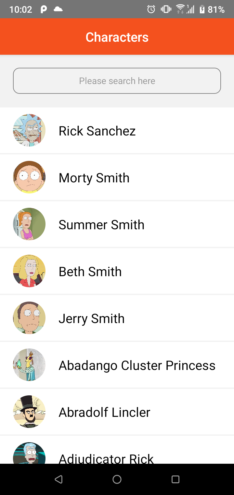
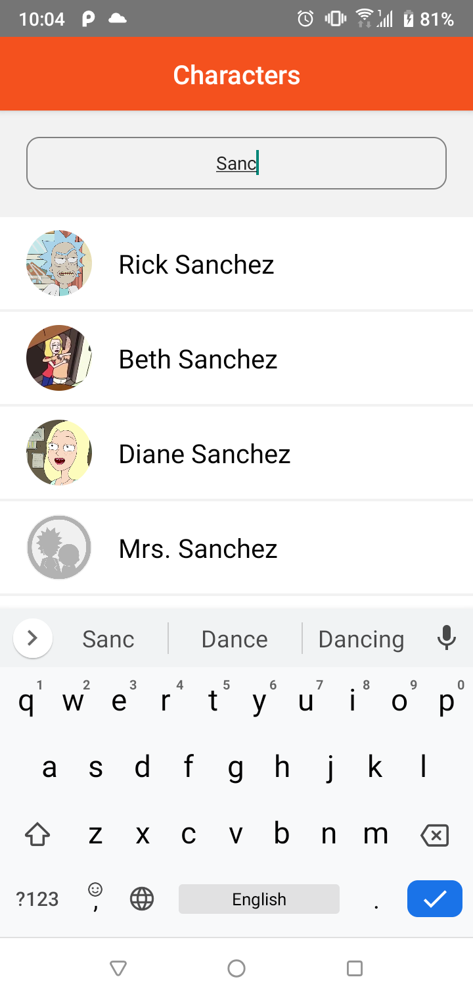
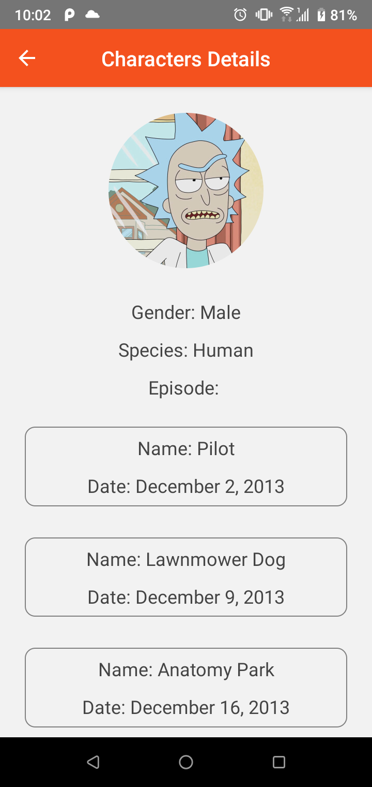

`Here is the app about rickandmortyapi`

 ### Technologies I have used
React-native, apolloGraphQL, react-navigation and jest

First install node_modules by

### `npm install`

Then run the app by following command
### `npx react-native run-android`

Then run the test by following command
### `npm test`

Please see the `screenshot` to see the view:

1. When you will open the app. you will see the following Home screen with list of characters.if you go down you will see infinite scrolling.

2. If you search it will show you filter results. 

3. If you click any of the row from the list you will be navigate to the next screen. you will see here characterDetails. 

